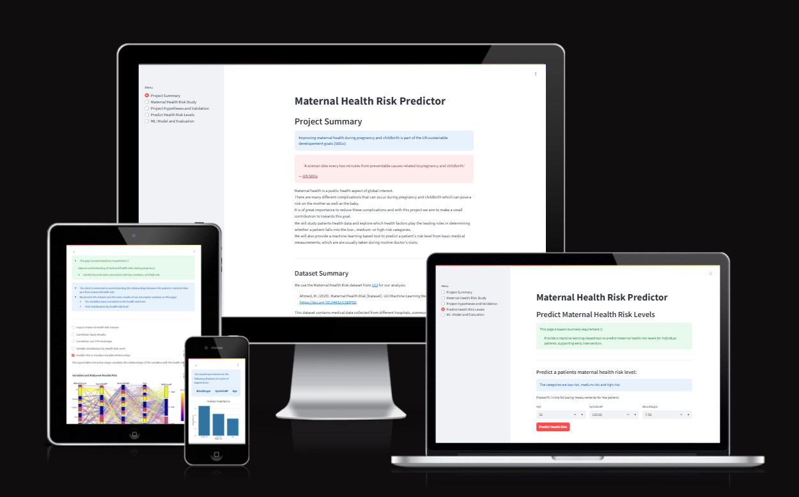
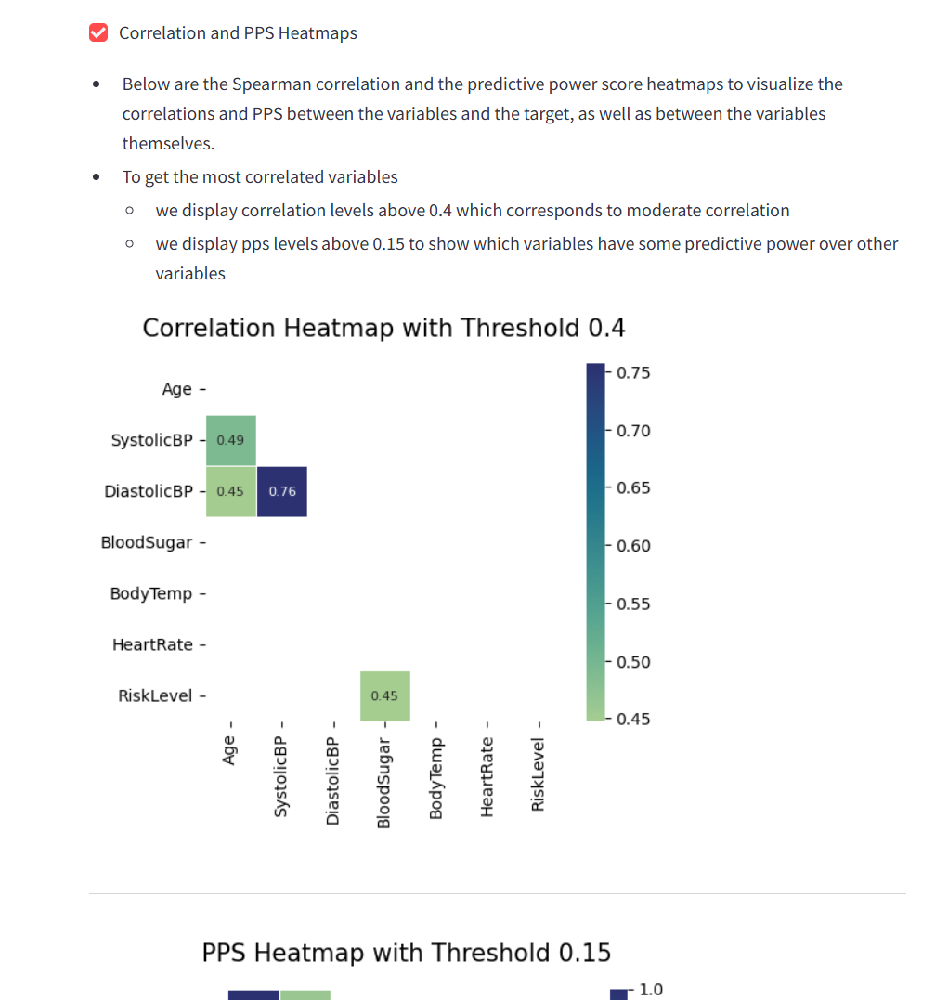
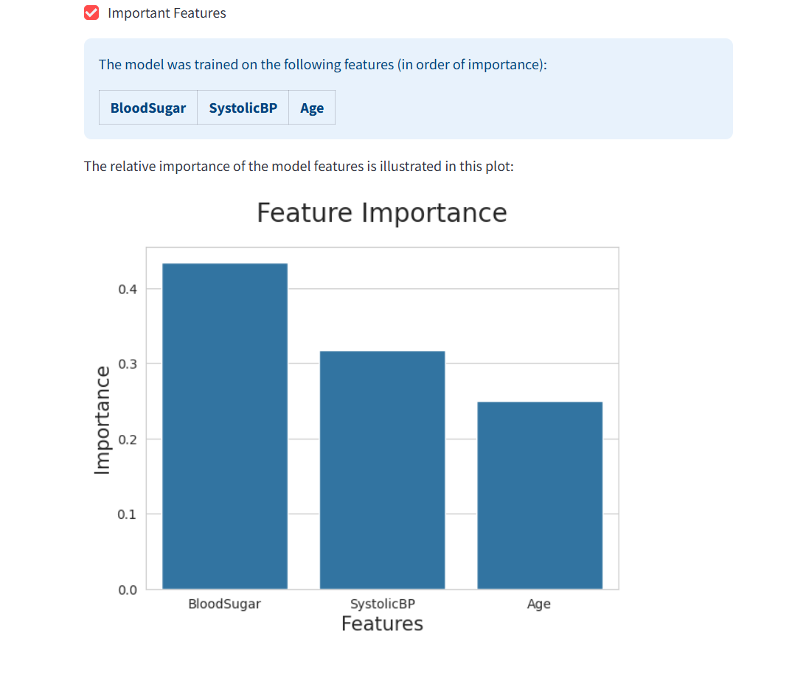
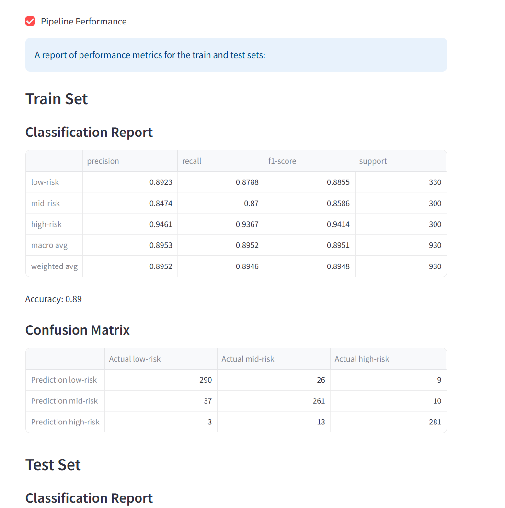

# [Maternal Health Risk Predictor](https://maternal-health-risk-predictor-f82f6452b3b6.herokuapp.com/)

[](https://www.github.com/theresaabl/ML-maternal-health-risk/commits/main)
[](https://www.github.com/theresaabl/ML-maternal-health-risk/commits/main)
[](https://www.github.com/theresaabl/ML-maternal-health-risk)

Live Site - [Maternal Health Risk Predictor](https://maternal-health-risk-predictor-f82f6452b3b6.herokuapp.com/)



source: [Maternal Health Risk Predictor - amiresponsive](https://ui.dev/amiresponsive?url=https://maternal-health-risk-predictor-f82f6452b3b6.herokuapp.com/)

## Summary

Improving maternal health during pregnancy and childbirth is part of the UN sustainable developement goals (SDGs):

>'A woman dies every two minutes from preventable causes related to pregnancy and childbirth.'
>
> \-  [UN SDGs](https://sdgs.un.org/goals/goal3)

Maternal health is a public health aspect of global interest.
There are many different complications that can occur during pregnancy and childbirth which can pose a risk on the mother as well as the baby.
It is of great importance to reduce these complications and with this project we aim to make a small contribution towards this goal.

* We will study patients' health data and explore which health factors play the leading roles in determining whether a patient falls into the low-, medium- or high-risk categories.
* We will also provide a machine-learning based tool to predict a patient's risk level from basic medical measurements, which are usually taken during routine prenatal care checkups.
* This will be presented in a dashboard.

## Dataset Content

We use the Maternal Health Risk dataset from [UCI](https://archive.ics.uci.edu/dataset/863/maternal+health+risk) for our analysis:

> Ahmed, M. (2020). Maternal Health Risk [Dataset].
> UCI Machine Learning Repository [https://doi.org/10.24432/C5DP5D](https://doi.org/10.24432/C5DP5D).
>

* This dataset contains medical data collected from different hospitals, community clinics and maternal health care centers from the rural areas of Bangladesh (see dataset metadata).
* The dataset has 1014 rows and 7 columns (note that the dataset presented on the streamlit dashboard has 1011 rows, where 3 erronous datapoints were already removed).
* Each Row contains health data about one patient, the variables are:

| Variable | Information | Type | Units |
| --- | --- | --- | --- |
|Age | Patient's age | numerical | years |
| SystolicBP | Patient's systolic blood pressure | numerical | mm Hg |
| DiastolicBP | Patient's diastolic blood pressure | numerical | mm Hg |
| BloodSugar | Patient's blood sugar level | numerical | mmol/l |
| BodyTemp | Patient's body temperatur | numerical | degrees Celcius |
| HeartRate | Patient's heart rate | numerical | bpm |
| RiskLevel | Patient's maternal health risk level | categorical | ['low-risk', 'mid-risk', 'high-risk'] |

* Where RiskLevel is the target that we want to predict
* There are three classes: low-risk, mid-risk and high-risk
  * Note: mid-risk and medium-risk are sometimes used interchangeably

## Business Requirements

A national health organisation has contacted us to study maternal health risk through a descriptive and predictive data analysis. The client provided the dataset.

There are **two business requirements** agreed on with the client:

* BR 1. Improve understanding of maternal health risks during pregnancy:
  * Identify key indicators associated with low, medium, and high risk.
* BR 2. Provide a machine learning–based tool to predict maternal health risk levels for individual patients, supporting early intervention.

Further:

* The clients goal is to use our results to develop new policies to improve pregnancy care and to support early interventions to mitigate health risks.
* They plan to provide our predictive analytics tool to health care professionals and thus, facilitate maternal health risk assessement during prenatal care.
* This could help risk assessement, e.g. in cases where:
  * The health professionals do not have a lot of experience yet
  * There is time pressure
  * No experts are available and GPs need to do the assessement

## Hypotheses and Validation

We state the following three hypotheses:

  1. We expect that high-risk patients tend to have high blood sugar levels.
  2. We expect that high-risk patients tend to have high systolic blood pressure levels.
  3. We expect that high-risk patients tend to have high diastolic blood pressure levels.
  4. We expect that high-risk patients tend to be of a higher age.

We come to these expectations by looking at literature about pregnancy health risk factors, e.g. in the following articles:

* [National Library of Medicine (US)](https://www.ncbi.nlm.nih.gov/books/NBK555485/)
* [Mayo Clinic](https://www.mayoclinic.org/healthy-lifestyle/pregnancy-week-by-week/in-depth/high-risk-pregnancy/art-20047012)
* [MSD Manuals](https://www.msdmanuals.com/home/women-s-health-issues/complications-of-pregnancy/risk-factors-for-pregnancy-complications#Problems-in-a-Previous-Pregnancy_v809815)

We find that hypertension (high blood pressure), diabetes (high blood sugar) and maternal age are mentioned as some of the leading risk factors. We look to validate these hypotheses through correlation studies and find out in more detail which of these factors play they largest roles.

### Validation

Indeed in the correlation study we find that blood sugar, blood pressure (systolic and diastolic) and age are the most correlated variables to the health risk level.

Our correlation study supports all three hypotheses:

* From the correlation levels of the variables with the health risk level, we conclude that:

1. High-risk patients tend to have high blood sugar levels.
2. High-risk patients tend to have high systolic and diastolic blood pressure levels, where the two are correlated between themselves.
3. High-risk patients tend to be of a higher age.

This is illustrated in the following Spearman correlation heatmap and predictive power score (pps) heatmap:


## Mapping Business Requirements to Data Visualizations and ML Tasks

Business requirements:

* BR 1. Improve understanding of maternal health risks during pregnancy:
  * Identify key indicators associated with low, medium, and high risk.
* BR 2. Provide a machine learning–based tool to predict maternal health risk levels for individual patients, supporting early intervention.

Data Visualizations and ML Tasks:

* BR 1:
  * Perform a correlation study of the features with the target variable to analyse which medical measurements are most correlated to the health risk level.
  * Use heatmaps to display the correlation levels and predictive power.
  * Display the distributions of the variables per health risk level to visualize the relationship.
  * Visualize the relationships in an interactive parallel plot that shows the relationships between all variables and the target.
  
* BR 2:
  * We will predict the health risk level of a given patient &rarr; multiclass Classification.
  * Perform data cleaning and feature engineering on the dataset to best prepare it for the predictive analysis.
  * Put the steps into a data cleaning and feature engineering pipeline.
  * The machine-learning tool will be a Classification - perform and extensive algorithm and hyperparameter search to find the best model for predictions on live data.
  * Balance performance and generalizability to find a model that has good recall and precision and also has a small train-test-gap (performance on test set is similar enough to train set).
  * Visualize the most important features.
  * Visualize the model performance with the help of confusion matrices.
  * Provide a live tool for predictions with user input data.

## ML Business Case

* In the previous bullet, you potentially visualized an ML task to answer a business requirement. You should frame the business case using the method we covered in the course

First draft:

BUISINESS CASE:

* Better understand maternal health risk during pregnancy with the goal to define strategies and policies to decrease the health risk.
* Understand the main indicators of low/medium/high risk
* Predict risk for individuals or for populations

Industries:

* Health and welfare
  * WHO
  * Local health authorities
*	Public Policy (?)
* Medical
  * Hospitals
  * OB/GYN practices
* Research
  * University
  * Non-academic research (government, ngo etc)

ML Model:
  Classification

Questions:

* What is the business objective requiring an ML solution?
  * Predict maternal health risk based on health data collected during routine visits
* Is data available for the training of the model, if yes which type of data?
  * Yes tabular data is available, it contains 6 features and 1 target:
    * Age: object
    * Systolic BP: int
    * Diastolic BP: int
    * BS: int
    * Body temperature: int
    * Heart rate: int
    * Target: risk: object (low/medium/high)
* Does the customer need a dashboard or an API endpoint?
  * dashboard
* What does success look like?
  * Dashboard with all required buisiness outputs:
* Can you break down the project into Epics and User Stories?
  * Information gathering and data collection
  * Data visualization, cleaning, and preparation
  * Model training, validation, and optimization.
  * Dashboard planning, designing, and development
  * Dashboard deployment and release.
* Ethical or Privacy concerns?
  * The Project can remain ethical if we use cell image data without the patient's name or secret information
* What level of prediction performance is needed?
  * Since this is a healthcare related project and we aim to identify high-risk patients we aim to optimize the ML classifier for recall of the high-risk class
  * Ideally, a recall of 80% or higher for high-risk patients is the goal
  * However, the dataset at hand is relatively small and also moderately imbalanced, so in this scenario a high-risk recall of 70% would also be a reasonably good performance.
  * With hyperparameter optimization we aim to reach a recall of above 80% but the minimum acceptable recall is 70% in this project.
* What are the project inputs and intended outputs?
  * Input: health data for a patient
  * Output: health risk level
* Does the data suggest a particular model?
  * Classification
* How will the customer benefit?
  * Analyses the main factors that contribute to pregnancy complications to inform health practitioners or policy makers.
  * Makes it possible to quickly predict the maternal health risk based on basic health data that is taken during routine visits anyways.
  * Makes the prediction more systematic and less room for individual error
  * Combine with experience of health professionals!
  * This allows less experienced staff to make predictions based on data from many women that they could not have gathered on their own
  * Makes predictions quickly when under time pressure

## Evaluation notes

Model without winsorizer:

RandomForestClassifier with max_depth 12:
train set high-risk recall: 88%
test set high-risk recall: 78%
difference: 10 percentage points
RandomForestClassifier with max_depth 8:
train set high-risk recall: 82%
test set high-risk recall: 75%
difference: 7 percentage points

Final model with winsorizer:

* model with only best features:
  * high-risk recall train: 94%
  * high-risk recall test: 87%
  * high-risk recall gap: 7 percentage points
  * low-risk-precision train: 89%
  * low-risk-precision test: 81%
  * low-risk-precision gap: 8 percentage points

## Dashboard Design

In this section we describe the design of the project dashboard including the pages and sections, the content of each section and a screenshot of the finished product.

| Page | Section | Content | Screenshot |
| --- | --- | --- | --- |
| All Pages | Menu | |  |
| Project Summary Page | Project summary | |  |
| Project Summary Page | Dataset summary | |  |
| Project Summary Page | Link to documentation | |  |
| Project Summary Page | Business requirements | |  |
| Maternal Health Risk Study Page | Maternal Health Risk Study Summary | |  |
| Maternal Health Risk Study Page | Checkboxes to display and hide different sections | |  |
| Maternal Health Risk Study Page | Inspect Maternal Health Risk Dataset | |  |
| Maternal Health Risk Study Page | Correlation Study Results | |  |
| Maternal Health Risk Study Page | Correlation and PPS Heatmaps | |  |
| Maternal Health Risk Study Page | Variable Distributions by Health Risk Level | |  |
| Maternal Health Risk Study Page | Parallel Plot to Visualize Variable Relationships | |  |
| Project Hypotheses and Validation Page | Project Hypotheses and Validation | |  |
| Predict Health Risk Levels Page | Predict Health Risk Levels Prediction Tool | |  |
| Predict Health Risk Levels Page | Prediction for Low Risk | |  |
| Predict Health Risk Levels Page | Prediction for Medium Risk | |  |
| Predict Health Risk Levels Page | Prediction for High Risk | |  |
| ML: Model and Evaluation | Model and Evaluation Summary | |  |
| ML: Model and Evaluation | ML Pipelines | |  |
| ML: Model and Evaluation | Features | |  |
| ML: Model and Evaluation | Pipeline Performance | |  |
| ML: Model and Evaluation | Visualization | |  |

## User Stories

Examples:

### EPIC: User Authentication

As a Confirmed Resident I can register an account so that I can access a resident dashboard.

User Stories:

* As a Site User I can sign up for an account so that I can request to get access to a resident dashboard.
* As a Site Administrator I can see all requests for a new user account so that I can confirm accounts for SharedSpaces residents only.
* As a Confirmed Resident I can login and logout of my account so that I can access a resident dashboard.
* As a Site User I can see a message when login does not work (yet) so that I can know whether my account has been approved yet or not.

## Possible Future Directions

There are many ways in which one could improve or extend this project. Some ideas are:

* Develop an API to embed the maternal health risk prediction tool into websites directly:
  * This could be useful for medical prefessionals, so they could use the predictor on their own websites and platforms
* Collect more data:
  * A larger dataset would help improve the analyses and predictions
  * More details about the measurements would be very helpful in improving the analysis and decision making (e.g. age values, blood sugar measurements)
* It would be very interesting to also study this data with a clustering model to study whether the algorithm finds similar clusters as the health risk labels or if it finds additional structure within the data.
* An even more extensive hyperparameter optimization together with a larger dataset and more feature engineering (when having more information about the health measurement details) could help improve the prediction performance.

## Main Data Analysis and Machine Learning Libraries

| Libraries | Use |
| --- | --- |
| [](https://pandas.pydata.org/) | Library for data structures and data analysis tools. |
| [](https://numpy.org/) | Library for scientific computing. |
| [](https://scipy.org/) | Library for fundamental algorithms for scientific computing in Python. |
| [](https://docs.profiling.ydata.ai/latest/) | Library for data profiling. |
| [](https://matplotlib.org/) | Library for visualizations in Python. |
| [](https://seaborn.pydata.org/) | Library for statistical data visualizations. |
| [](https://plotly.com/python/plotly-express/) | Library for interactive charts. |
| [](https://feature-engine.trainindata.com/en/latest/) |  Library with multiple transformers to engineer and select features for machine learning models. |
| [](https://pypi.org/project/ppscore/) |  Library with python implementation of the Predictive Power Score. |
| [](https://scikit-learn.org/stable/) | Library for predictive data analysis. |
| [](https://xgboost.readthedocs.io/en/release_3.0.0/) |  Library for optimized distributed gradient boosting. |
| [](https://imbalanced-learn.org/stable/) |  Library for classification with imbalanced classes. |
| [](https://joblib.readthedocs.io/en/stable/) |  Library for lightweight pipelining in Python. |

## Tools and Technologies

| Tool / Tech | Use |
| --- | --- |
| [](https://markdown.2bn.dev) | Generate README and TESTING templates. |
| [](https://git-scm.com) | Version control. (`git add`, `git commit`, `git push`) |
| [](https://github.com) | Secure online code storage and Codespaces as cloud IDE for development. |
| [](https://jupyter.org/) | Descriptive and predictive data analysis and documentation for the back-end. |
| [](https://www.python.org) | Back-end and front-end programming language. |
| [](https://streamlit.io/) | App framework to create front-end. |
| [](https://www.heroku.com) | Hosting the deployed back-end site. |
| [](https://chat.openai.com) | Help debug, troubleshoot, and explain things. |
| [](https://www.python.org) | Back-end and front-end programming language. |

## Testing

> [!NOTE]
> For all testing, please refer to the [TESTING.md](TESTING.md) file.

## Deployment

The live application can be found deployed on [Heroku](https://maternal-health-risk-predictor-f82f6452b3b6.herokuapp.com/).

### Heroku Deployment

This project uses [Heroku](https://www.heroku.com), a platform as a service (PaaS) that enables developers to build, run, and operate applications entirely in the cloud.

Deployment steps are as follows, after account setup:

* Select **New** in the top-right corner of your Heroku Dashboard, and select **Create new app** from the dropdown menu.
* Your app name must be unique, and then choose a region closest to you (EU or USA), then finally, click **Create App**.

Heroku needs some additional files in order to deploy properly.

* [requirements.txt](requirements.txt)
* [Procfile](Procfile)
* [setup.sh](setup.sh)

You can install this project's **[requirements.txt](requirements.txt)** (*where applicable*) using:

* `pip3 install -r requirements.txt`

If you have your own packages that have been installed, then the requirements file needs updated using:

* `pip3 freeze --local > requirements.txt`
* Note to only add packages needed for the live app, not those only used in jupyter notebooks.

The **[Procfile](Procfile)** can be created with the following command:

* `echo web: sh setup.sh && streamlit run app.py > Procfile`

The **[setup.sh](setup.sh)** file needs to look like:

```python
mkdir -p ~/.streamlit/
echo "\
[server]\n\
headless = true\n\
port = $PORT\n\
enableCORS = false\n\
\n\
" > ~/.streamlit/config.toml

```

For Heroku deployment, follow these steps to connect your own GitHub repository to the newly created app:

* At the Deploy tab, select GitHub as the deployment method.
* Select your repository name and click Search. Once it is found, click Connect.

Either (*recommended*):

* Select **Automatic Deployment** from the Heroku app.

Or:

* In the Terminal/CLI, connect to Heroku using this command: `heroku login -i`
* Set the remote for Heroku: `heroku git:remote -a app_name` (*replace `app_name` with your app name*)
* After performing the standard Git `add`, `commit`, and `push` to GitHub, you can now type:
* `git push heroku main`

The project should now be connected and deployed to Heroku!

If the slug size is too large then:

* Add large files not required for the app to the .slugignore file.
* Only add packages to requirements.txt that are needed in the live app, not those only used in jupyter notebooks (some ML packages can be very large).

### Local Development

This project can be cloned or forked in order to make a local copy on your own system.

For either method, you will need to install any applicable packages found within the [requirements.txt](requirements.txt) file.

* `pip3 install -r requirements.txt`.

> [!IMPORTANT]
> This is a sample only; you would replace the values with your own if cloning/forking my repository.

#### Cloning

You can clone the repository by following these steps:

1. Go to the [GitHub repository](https://www.github.com/theresaabl/ML-maternal-health-risk).
2. Locate and click on the green "Code" button at the very top, above the commits and files.
3. Select whether you prefer to clone using "HTTPS", "SSH", or "GitHub CLI", and click the "copy" button to copy the URL to your clipboard.
4. Open "Git Bash" or "Terminal".
5. Change the current working directory to the location where you want the cloned directory.
6. In your IDE Terminal, type the following command to clone the repository:
	* `git clone https://www.github.com/theresaabl/ML-maternal-health-risk.git`
7. Press "Enter" to create your local clone.

#### Forking

By forking the GitHub Repository, you make a copy of the original repository on our GitHub account to view and/or make changes without affecting the original owner's repository. You can fork this repository by using the following steps:

1. Log in to GitHub and locate the [GitHub Repository](https://www.github.com/theresaabl/ML-maternal-health-risk).
2. At the top of the Repository, just below the "Settings" button on the menu, locate and click the "Fork" Button.
3. Once clicked, you should now have a copy of the original repository in your own GitHub account!

### Local VS Deployment

There are no remaining major differences between the local version when compared to the deployed version online.

## Credits

### Content

| Source | Notes |
| --- | --- |
| [UCI Machine Learning Repository](https://archive.ics.uci.edu/dataset/863/maternal+health+risk) | Maternal Health Risk Dataset - dataset for this project |
| [Markdown Builder](https://markdown.2bn.dev) | Help generating Markdown files used as basis for parts of this documentation |
| [Churnometer](https://github.com/Code-Institute-Solutions/churnometer) | Code Institute walkthrough project inspiration, several custom functions used and adapted throughout the project |
| [ChatGPT](https://chatgpt.com) | Help with debugging and explanations |
| [Stackoverflow](https://stackoverflow.com/a/59839952) | Change label font size in seaborn plot |
| [Stackoverflow](https://stackoverflow.com/a/72034697) | Change tick and label font size in plotly express plot |
| [Discuss Streamlit](https://tinyurl.com/3dcv98ms) | Change dataframe containing dtypes as a column to dtype string |

### Acknowledgements

* I would like to thank my Code Institute mentor, [Mo Shami](https://github.com/mshami) for the support throughout the development of this project.
* I would like to thank my Code Institute mentor, [Tim Nelson](https://www.github.com/TravelTimN) for providing a great template for the documentation of this project.
