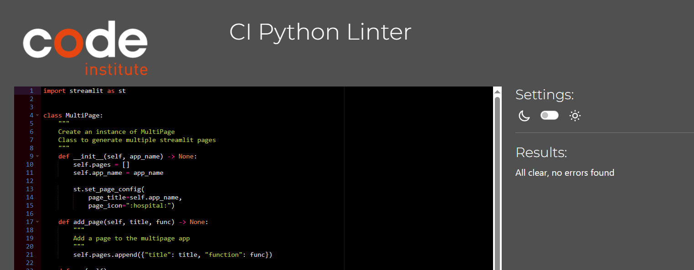
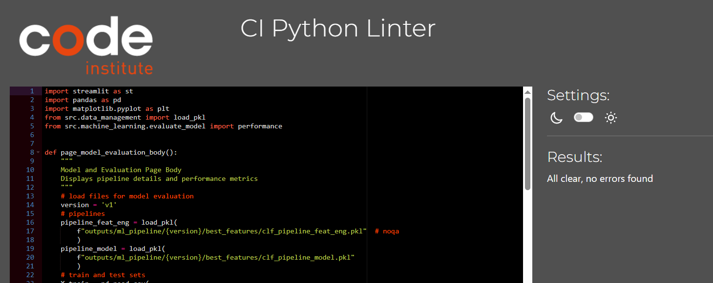

# Testing

> [!NOTE]
> Return back to the [README.md](README.md) file.

## Code Validation

### Python

I have used the recommended [PEP8 CI Python Linter](https://pep8ci.herokuapp.com) to validate all of my Python files.

| Directory | File | URL | Screenshot |
| --- | --- | --- | --- |
|  | [app.py](https://github.com/theresaabl/ML-maternal-health-risk/blob/main/app.py) | [PEP8 CI Link](https://pep8ci.herokuapp.com/https://raw.githubusercontent.com/theresaabl/ML-maternal-health-risk/main/app.py) |  |
| src | [data_management.py](https://github.com/theresaabl/ML-maternal-health-risk/blob/main/src/data_management.py) | [PEP8 CI Link](https://pep8ci.herokuapp.com/https://raw.githubusercontent.com/theresaabl/ML-maternal-health-risk/main/src/data_management.py) |  |
| src/machine_learning | [create_plots.py](https://github.com/theresaabl/ML-maternal-health-risk/blob/main/src/machine_learning/create_plots.py) | [PEP8 CI Link](https://pep8ci.herokuapp.com/https://raw.githubusercontent.com/theresaabl/ML-maternal-health-risk/main/src/machine_learning/create_plots.py) |  |
| src/machine_learning | [evaluate_model.py](https://github.com/theresaabl/ML-maternal-health-risk/blob/main/src/machine_learning/evaluate_model.py) | [PEP8 CI Link](https://pep8ci.herokuapp.com/https://raw.githubusercontent.com/theresaabl/ML-maternal-health-risk/main/src/machine_learning/evaluate_model.py) |  |
| src/machine_learning | [predictive_analysis.py](https://github.com/theresaabl/ML-maternal-health-risk/blob/main/src/machine_learning/predictive_analysis.py) | [PEP8 CI Link](https://pep8ci.herokuapp.com/https://raw.githubusercontent.com/theresaabl/ML-maternal-health-risk/main/src/machine_learning/predictive_analysis.py) |  |
| app_pages | [multipage.py](https://github.com/theresaabl/ML-maternal-health-risk/blob/main/app_pages/multipage.py) | [PEP8 CI Link](https://pep8ci.herokuapp.com/https://raw.githubusercontent.com/theresaabl/ML-maternal-health-risk/main/app_pages/multipage.py) |  |
| app_pages | [page_health_risk_study.py](https://github.com/theresaabl/ML-maternal-health-risk/blob/main/app_pages/page_health_risk_study.py) | [PEP8 CI Link](https://pep8ci.herokuapp.com/https://raw.githubusercontent.com/theresaabl/ML-maternal-health-risk/main/app_pages/page_health_risk_study.py) |  |
| app_pages | [page_model_evaluation.py](https://github.com/theresaabl/ML-maternal-health-risk/blob/main/app_pages/page_model_evaluation.py) | [PEP8 CI Link](https://pep8ci.herokuapp.com/https://raw.githubusercontent.com/theresaabl/ML-maternal-health-risk/main/app_pages/page_model_evaluation.py) |  |
| app_pages | [page_predict_risk_level.py](https://github.com/theresaabl/ML-maternal-health-risk/blob/main/app_pages/page_predict_risk_level.py) | [PEP8 CI Link](https://pep8ci.herokuapp.com/https://raw.githubusercontent.com/theresaabl/ML-maternal-health-risk/main/app_pages/page_predict_risk_level.py) |  |
| app_pages | [page_project_hypothesis.py](https://github.com/theresaabl/ML-maternal-health-risk/blob/main/app_pages/page_project_hypothesis.py) | [PEP8 CI Link](https://pep8ci.herokuapp.com/https://raw.githubusercontent.com/theresaabl/ML-maternal-health-risk/main/app_pages/page_project_hypothesis.py) |  |
| app_pages | [page_summary.py](https://github.com/theresaabl/ML-maternal-health-risk/blob/main/app_pages/page_summary.py) | [PEP8 CI Link](https://pep8ci.herokuapp.com/https://raw.githubusercontent.com/theresaabl/ML-maternal-health-risk/main/app_pages/page_summary.py) |  |

## Manual Testing

Examples:

| Feature | Expectation | Test | Result | Screenshot |
| --- | --- | --- | --- | --- |
| Register | Feature is expected to allow users to sign up for an account, once the user signs up the account is set to inactive and the account inactive page is shown. | Signed up as a new user, entering valid user data. | Account was created successfully, a message was shown and the account inactive page was displayed. |  |
|  | Feature is expected to show a warning when user enters invalid data or fields are left empty. | Signed up as a new user, entering invalid user data or leaving fields empty. | Warning was shown inside the form. | (This is handled by allauth) |
| Login | Feature is expected to allow registered users with active accounts to sign in and access the resident dashboard. | Signed in with an active user account. | The resident space page was displayed. |  |

## User Story Testing

Examples:

| Target | Expectation | Outcome | Screenshot |
| --- | --- | --- | --- |
| As a Site User |  I can sign up for an account | so that I can request to get access to a resident dashboard. |  |
| As a Site User | I can see a message when login does not work (yet) | so that I can know whether my account has been approved yet or not. |  |
| As a Site User | I can see the home page | so that I know what this site is about. |  |

## Bugs

### Fixed Bugs

I have used [GitHub Issues](https://www.github.com/theresaabl/ML-maternal-health-risk/issues) to track and manage bugs and issues during the development stages of my project.

All previously closed/fixed bugs can be tracked [here](https://www.github.com/theresaabl/ML-maternal-health-risk/issues?q=is%3Aissue+is%3Aclosed+label%3Abug).

Examples:

### Unfixed Bugs

> [!IMPORTANT]
> There are no remaining bugs that I am aware of, though, even after thorough testing, I cannot rule out the possibility.