# Testing

> [!NOTE]
> Return back to the [README.md](README.md) file.

## Python Code Validation

I have used the recommended [PEP8 CI Python Linter](https://pep8ci.herokuapp.com) to validate all of my Python files.

Further, I used [nbqa](https://pypi.org/project/nbqa/) with flake8 to validate all python code inside my Jupyter notebooks. To do this I followed the following steps:

* Install nbqa with: `pip install nbqa`
* Run in terminal: `nbqa flake8 your_notebook.ipynb`
* Repeat the second step for each notebook and the errors and warnings will be displayed in the terminal
* See the screenshots with empty terminal output, meaning no warnings or errors found

| Directory | File | URL | Screenshot |
| --- | --- | --- | --- |
|  | [app.py](https://github.com/theresaabl/ML-maternal-health-risk/blob/main/app.py) | [PEP8 CI Link](https://pep8ci.herokuapp.com/https://raw.githubusercontent.com/theresaabl/ML-maternal-health-risk/main/app.py) |  |
| app_pages | [multipage.py](https://github.com/theresaabl/ML-maternal-health-risk/blob/main/app_pages/multipage.py) | [PEP8 CI Link](https://pep8ci.herokuapp.com/https://raw.githubusercontent.com/theresaabl/ML-maternal-health-risk/main/app_pages/multipage.py) |  |
| app_pages | [page_health_risk_study.py](https://github.com/theresaabl/ML-maternal-health-risk/blob/main/app_pages/page_health_risk_study.py) | [PEP8 CI Link](https://pep8ci.herokuapp.com/https://raw.githubusercontent.com/theresaabl/ML-maternal-health-risk/main/app_pages/page_health_risk_study.py) |  |
| app_pages | [page_model_evaluation.py](https://github.com/theresaabl/ML-maternal-health-risk/blob/main/app_pages/page_model_evaluation.py) | [PEP8 CI Link](https://pep8ci.herokuapp.com/https://raw.githubusercontent.com/theresaabl/ML-maternal-health-risk/main/app_pages/page_model_evaluation.py) |  |
| app_pages | [page_predict_risk_level.py](https://github.com/theresaabl/ML-maternal-health-risk/blob/main/app_pages/page_predict_risk_level.py) | [PEP8 CI Link](https://pep8ci.herokuapp.com/https://raw.githubusercontent.com/theresaabl/ML-maternal-health-risk/main/app_pages/page_predict_risk_level.py) |  |
| app_pages | [page_project_hypothesis.py](https://github.com/theresaabl/ML-maternal-health-risk/blob/main/app_pages/page_project_hypothesis.py) | [PEP8 CI Link](https://pep8ci.herokuapp.com/https://raw.githubusercontent.com/theresaabl/ML-maternal-health-risk/main/app_pages/page_project_hypothesis.py) |  |
| app_pages | [page_summary.py](https://github.com/theresaabl/ML-maternal-health-risk/blob/main/app_pages/page_summary.py) | [PEP8 CI Link](https://pep8ci.herokuapp.com/https://raw.githubusercontent.com/theresaabl/ML-maternal-health-risk/main/app_pages/page_summary.py) |  |
| src | [data_management.py](https://github.com/theresaabl/ML-maternal-health-risk/blob/main/src/data_management.py) | [PEP8 CI Link](https://pep8ci.herokuapp.com/https://raw.githubusercontent.com/theresaabl/ML-maternal-health-risk/main/src/data_management.py) |  |
| src/machine_learning | [create_plots.py](https://github.com/theresaabl/ML-maternal-health-risk/blob/main/src/machine_learning/create_plots.py) | [PEP8 CI Link](https://pep8ci.herokuapp.com/https://raw.githubusercontent.com/theresaabl/ML-maternal-health-risk/main/src/machine_learning/create_plots.py) |  |
| src/machine_learning | [evaluate_model.py](https://github.com/theresaabl/ML-maternal-health-risk/blob/main/src/machine_learning/evaluate_model.py) | [PEP8 CI Link](https://pep8ci.herokuapp.com/https://raw.githubusercontent.com/theresaabl/ML-maternal-health-risk/main/src/machine_learning/evaluate_model.py) |  |
| src/machine_learning | [predictive_analysis.py](https://github.com/theresaabl/ML-maternal-health-risk/blob/main/src/machine_learning/predictive_analysis.py) | [PEP8 CI Link](https://pep8ci.herokuapp.com/https://raw.githubusercontent.com/theresaabl/ML-maternal-health-risk/main/src/machine_learning/predictive_analysis.py) |  |
| jupyter_notebooks | [01-DataCollection.ipynb](https://github.com/theresaabl/ML-maternal-health-risk/blob/main/jupyter_notebooks/01-DataCollection.ipynb) | Run in terminal |  |
| jupyter_notebooks | [02-MaternalHealthRiskStudyA.ipynb](https://github.com/theresaabl/ML-maternal-health-risk/blob/main/jupyter_notebooks/02-MaternalHealthRiskStudyA.ipynb) | Run in terminal |  |
| jupyter_notebooks | [03-MaternalHealthRiskStudyB.ipynb](https://github.com/theresaabl/ML-maternal-health-risk/blob/main/jupyter_notebooks/03-MaternalHealthRiskStudyB.ipynb) | Run in terminal |  |
| jupyter_notebooks | [04-DataCleaning.ipynb](https://github.com/theresaabl/ML-maternal-health-risk/blob/main/jupyter_notebooks/04-DataCleaning.ipynb) | Run in terminal | 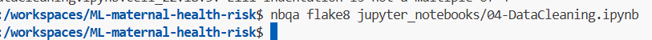 |
| jupyter_notebooks | [05-FeatureEngineering.ipynb](https://github.com/theresaabl/ML-maternal-health-risk/blob/main/jupyter_notebooks/05-FeatureEngineering.ipynb) | Run in terminal |  |
| jupyter_notebooks | [06-ModellingAndEvaluation-ClassificationA.ipynb](https://github.com/theresaabl/ML-maternal-health-risk/blob/main/jupyter_notebooks/06-ModellingAndEvaluation-ClassificationA.ipynb) | Run in terminal |  |
| jupyter_notebooks | [07-ModellingAndEvaluation-ClassificationB.ipynb](https://github.com/theresaabl/ML-maternal-health-risk/blob/main/jupyter_notebooks/07-ModellingAndEvaluation-ClassificationB.ipynb) | Run in terminal |  |

## User Story Testing

| Target | Expectation | Outcome | Jupyter Notebook or Dashboard Page | Plot or Screenshot (if applicable) |
| --- | --- | --- | --- | --- |
| As a data practitioner | I can import the maternal health dataset into my notebook and save it to a local folder | so that I can load it to analyse and process it | [01-DataCollection.ipynb](https://github.com/theresaabl/ML-maternal-health-risk/blob/main/jupyter_notebooks/01-DataCollection.ipynb) |  |
| As a data practitioner | I can inspect the dataset | so that I can see whether there are any missing values | [02-MaternalHealthRiskStudyA.ipynb](https://github.com/theresaabl/ML-maternal-health-risk/blob/main/jupyter_notebooks/02-MaternalHealthRiskStudyA.ipynb) |  |
| As a data practitioner | I can visualize the distributions of the variables | so that I can better understand the data | [02-MaternalHealthRiskStudyA.ipynb](https://github.com/theresaabl/ML-maternal-health-risk/blob/main/jupyter_notebooks/02-MaternalHealthRiskStudyA.ipynb),  [03-MaternalHealthRiskStudyB.ipynb](https://github.com/theresaabl/ML-maternal-health-risk/blob/main/jupyter_notebooks/03-MaternalHealthRiskStudyB.ipynb),  [05-FeatureEngineering.ipynb](https://github.com/theresaabl/ML-maternal-health-risk/blob/main/jupyter_notebooks/05-FeatureEngineering.ipynb) |  |
| As a data practitioner | I can analyse whether there are any outliers in the data | so that I can decide how to handle eventual outliers | [02-MaternalHealthRiskStudyA.ipynb](https://github.com/theresaabl/ML-maternal-health-risk/blob/main/jupyter_notebooks/02-MaternalHealthRiskStudyA.ipynb) |  |
| As a data practitioner | I can perform a correlation study | so that I can understand how much each of the variables is correlated to the target and with the other variables | [02-MaternalHealthRiskStudyA.ipynb](https://github.com/theresaabl/ML-maternal-health-risk/blob/main/jupyter_notebooks/02-MaternalHealthRiskStudyA.ipynb),  [03-MaternalHealthRiskStudyB.ipynb](https://github.com/theresaabl/ML-maternal-health-risk/blob/main/jupyter_notebooks/03-MaternalHealthRiskStudyB.ipynb), [04-DataCleaning.ipynb](https://github.com/theresaabl/ML-maternal-health-risk/blob/main/jupyter_notebooks/04-DataCleaning.ipynb) |  |
| As a data practitioner | I can create different plots (heatmaps, distributions per target class, parallel plot) | so that I can visualize the relationships between the variables and the target | [02-MaternalHealthRiskStudyA.ipynb](https://github.com/theresaabl/ML-maternal-health-risk/blob/main/jupyter_notebooks/02-MaternalHealthRiskStudyA.ipynb),  [03-MaternalHealthRiskStudyB.ipynb](https://github.com/theresaabl/ML-maternal-health-risk/blob/main/jupyter_notebooks/03-MaternalHealthRiskStudyB.ipynb), [04-DataCleaning.ipynb](https://github.com/theresaabl/ML-maternal-health-risk/blob/main/jupyter_notebooks/04-DataCleaning.ipynb) |  |
| As a data practitioner | I can remove outliers that seem to be erronous datapoints | so that I get a dataset free from wrong entries | [04-DataCleaning.ipynb](https://github.com/theresaabl/ML-maternal-health-risk/blob/main/jupyter_notebooks/04-DataCleaning.ipynb) |  |
| As a data practitioner | I can study different possible transformations that could make the variables more normally distributed | so that I can decide which transformation steps to take in the feature engineering pipeline | [05-FeatureEngineering.ipynb](https://github.com/theresaabl/ML-maternal-health-risk/blob/main/jupyter_notebooks/05-FeatureEngineering.ipynb) |  |
| As a data practitioner | I can study the target balance of the dataset | so that I can decide whether to perform sample rebalancing | [06-ModellingAndEvaluation-ClassificationA.ipynb](https://github.com/theresaabl/ML-maternal-health-risk/blob/main/jupyter_notebooks/06-ModellingAndEvaluation-ClassificationA.ipynb), [07-ModellingAndEvaluation-ClassificationB.ipynb](https://github.com/theresaabl/ML-maternal-health-risk/blob/main/jupyter_notebooks/07-ModellingAndEvaluation-ClassificationB.ipynb) |  |
| As a data practitioner | I can split my data into train and test set | so that I can use it to fit the pipelines to | [06-ModellingAndEvaluation-ClassificationA.ipynb](https://github.com/theresaabl/ML-maternal-health-risk/blob/main/jupyter_notebooks/06-ModellingAndEvaluation-ClassificationA.ipynb), [07-ModellingAndEvaluation-ClassificationB.ipynb](https://github.com/theresaabl/ML-maternal-health-risk/blob/main/jupyter_notebooks/07-ModellingAndEvaluation-ClassificationB.ipynb) |  |
| As a data practitioner | I can define a feature engineering pipeline and fit and transform the dataset accordingly | so that I can prepare the data for the model pipeline | [06-ModellingAndEvaluation-ClassificationA.ipynb](https://github.com/theresaabl/ML-maternal-health-risk/blob/main/jupyter_notebooks/06-ModellingAndEvaluation-ClassificationA.ipynb) |  |
| As a data practitioner | I can perform a grid search with different Classifier models | so that I can find the best model for my data | [06-ModellingAndEvaluation-ClassificationA.ipynb](https://github.com/theresaabl/ML-maternal-health-risk/blob/main/jupyter_notebooks/06-ModellingAndEvaluation-ClassificationA.ipynb), [07-ModellingAndEvaluation-ClassificationB.ipynb](https://github.com/theresaabl/ML-maternal-health-risk/blob/main/jupyter_notebooks/07-ModellingAndEvaluation-ClassificationB.ipynb) |  |
| As a data practitioner | I can perform an extensive hyperparameter optimization search | so that I can find the best hyperparameters to get the best performance while keeping good generalizability (small train-test-gap) | [06-ModellingAndEvaluation-ClassificationA.ipynb](https://github.com/theresaabl/ML-maternal-health-risk/blob/main/jupyter_notebooks/06-ModellingAndEvaluation-ClassificationA.ipynb) |  |
| As a data practitioner | I can train the best model with the best hyperparameters and fit it with all features | so that I can validate it and find the best features used to train the model | [06-ModellingAndEvaluation-ClassificationA.ipynb](https://github.com/theresaabl/ML-maternal-health-risk/blob/main/jupyter_notebooks/06-ModellingAndEvaluation-ClassificationA.ipynb) | 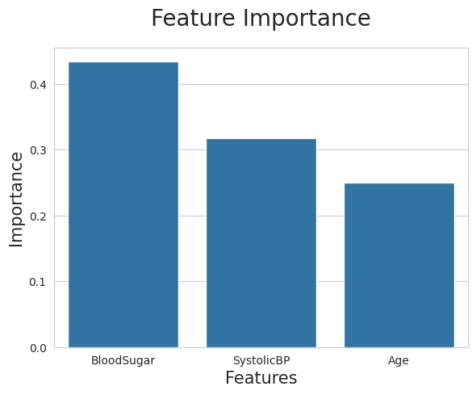 |
| As a data practitioner | I can refit the feature engineering and model pipelines using only the best features found in the previous point | so that I can define an optimized pipeline | [07-ModellingAndEvaluation-ClassificationB.ipynb](https://github.com/theresaabl/ML-maternal-health-risk/blob/main/jupyter_notebooks/07-ModellingAndEvaluation-ClassificationB.ipynb) |  |
| As a data practitioner | I can evaluate the pipeline | so that I can check whether the performance metrics meet the criteria set in the ML Business Case | [07-ModellingAndEvaluation-ClassificationB.ipynb](https://github.com/theresaabl/ML-maternal-health-risk/blob/main/jupyter_notebooks/07-ModellingAndEvaluation-ClassificationB.ipynb) | 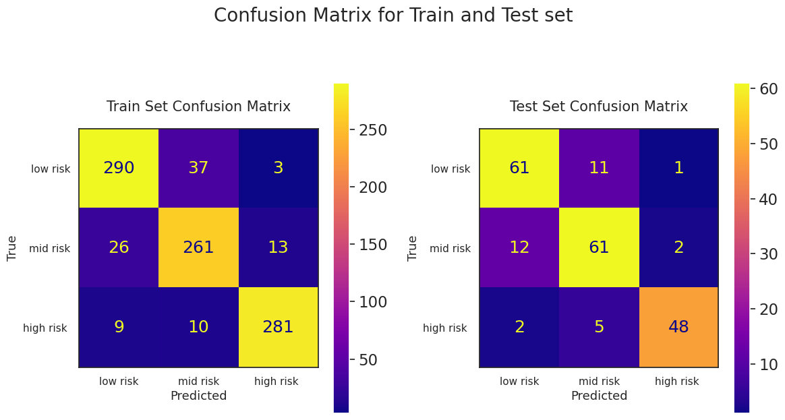 |
| As a data practitioner | I can display the results of my analysis | so that I can share them with the client | Maternal Health Risk Study Page, Project Hypotheses and Validation Page | 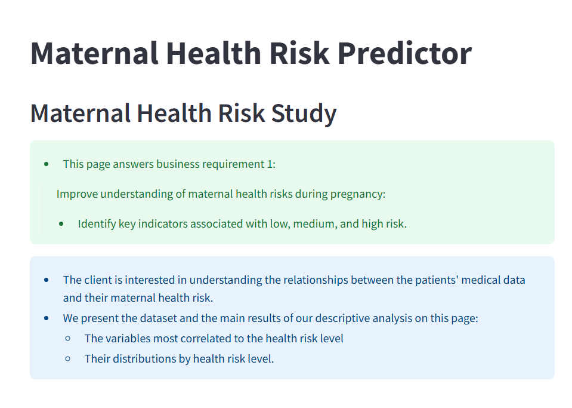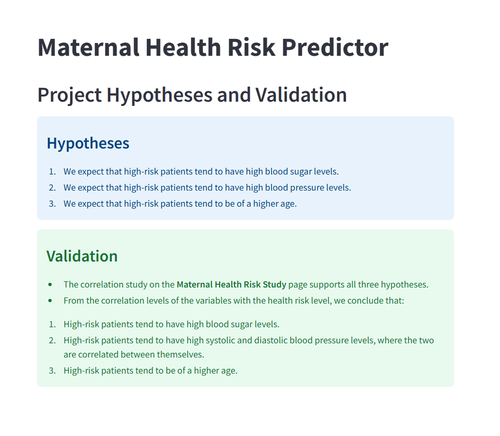 |
| As a data practitioner | I can provide the ML prediction tool | so that I can share it with the client | Predict Health Risk Levels Page | 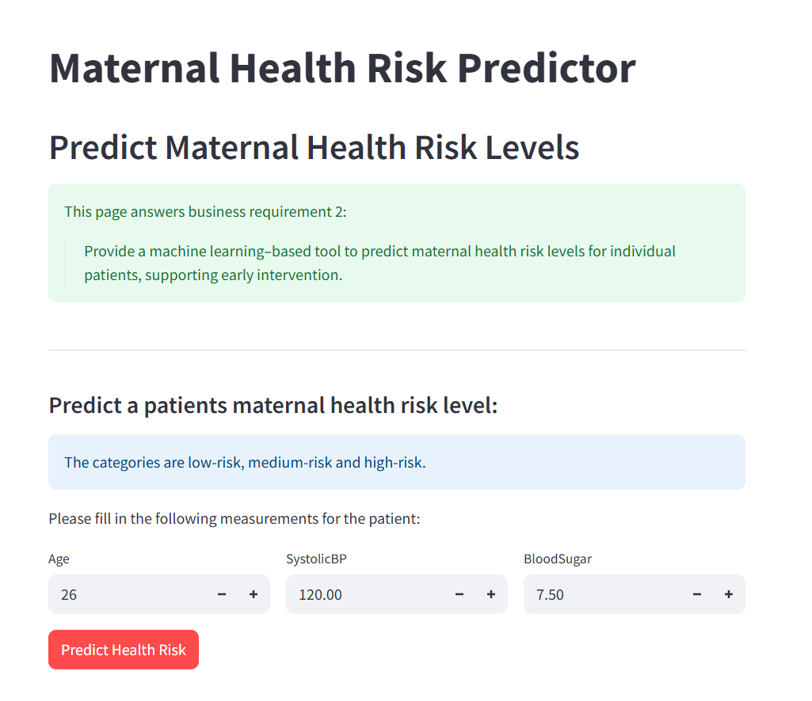 |
| As a client | I can see a project summary including a dataset summary and the business requirements | so that I can know what this project is about | Project Summary Page |   |
| As a client | I can inspect the dataset | so that I can see what data was used for the analysis | Maternal Health Risk Study Page | 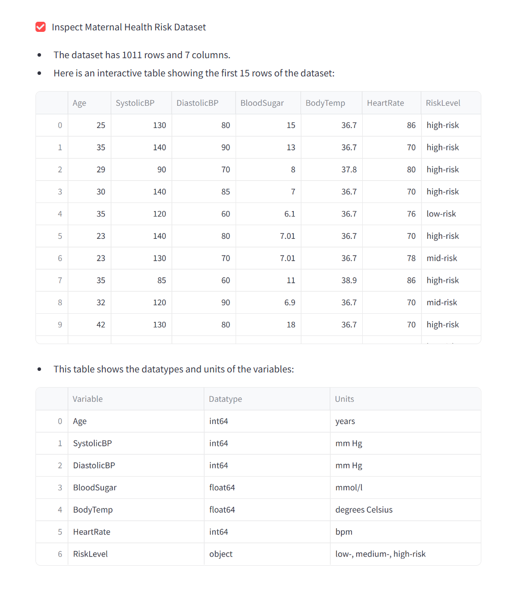 |
| As a client | I can see the results of the correlation study | so that I can better understand which variables are most correlated to the health risk level | Maternal Health Risk Study Page | 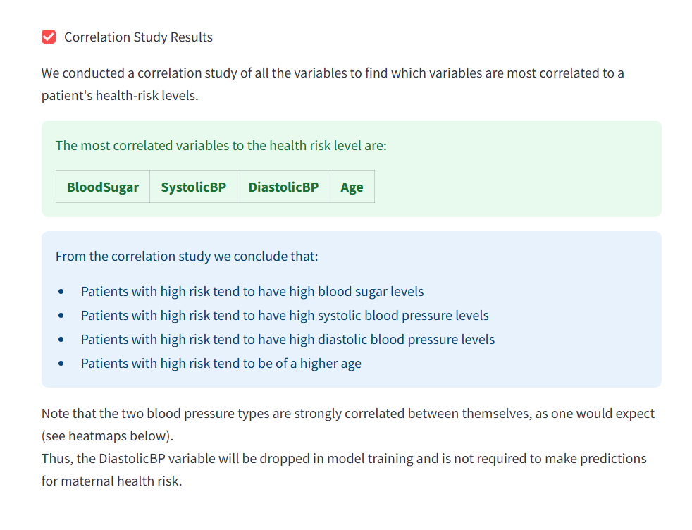 |
| As a client | I can see visualizations of the correlation study | so that I can better understand the relationships between the variables | Maternal Health Risk Study Page | 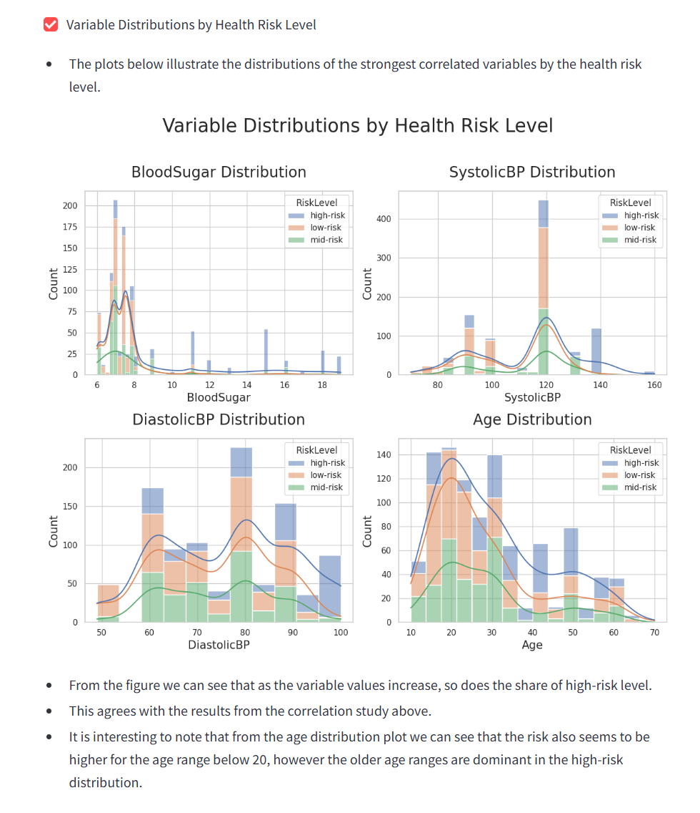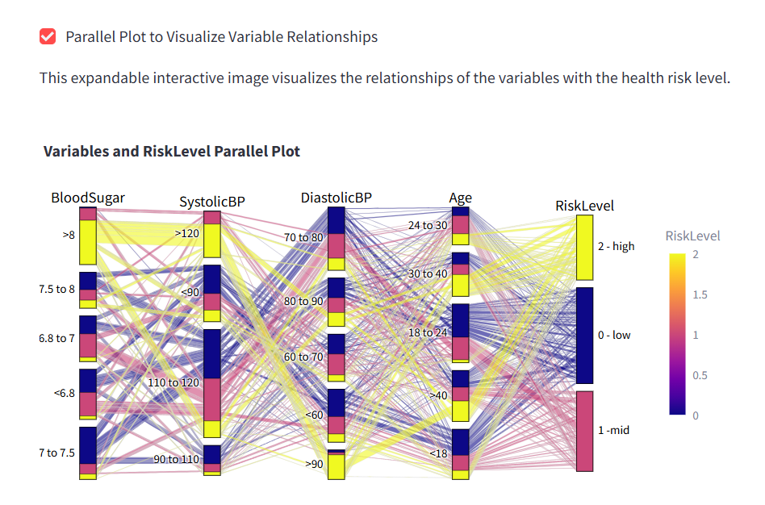 |
| As a client | I can see the project hypotheses and validation | so that I can see at first sight what the results of the analysis are | Project Hypotheses and Validation Page |  |
| As a client | I can access the ML Classification tool | so that I can make predictions on the health risk of real patients by inputting a few health measurements |  Predict Health Risk Levels Page |  |
| As a client | I can see information about the model and its evaluation | so that I can better understand the performance of the model and the reliability of the predictions | ML: Model and Evaluation Page | 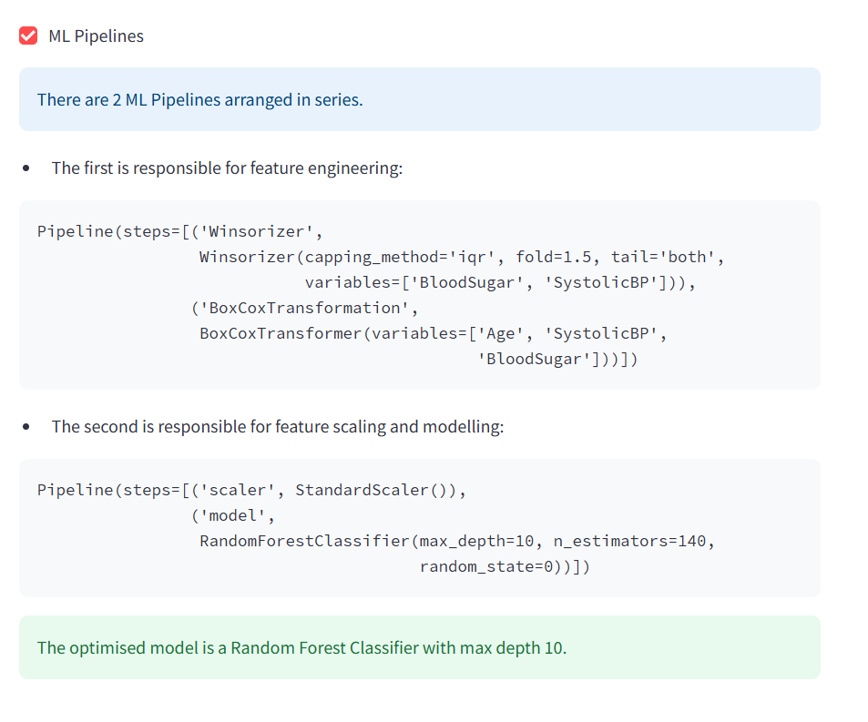 |
| As a data practitioner | I can present my results and provide my ML tool on a live site | so that I can provide them to the client | [Live Site](https://maternal-health-risk-predictor-f82f6452b3b6.herokuapp.com/) |  |
| As a client | I can access the dashboard including the ML tool on a live site | so that I can use the results and the tool | [Live Site](https://maternal-health-risk-predictor-f82f6452b3b6.herokuapp.com/) |  |

## Bugs

### Fixed Bugs

I have used [GitHub Issues](https://www.github.com/theresaabl/ML-maternal-health-risk/issues) to track and manage bugs and issues during the development stages of my project.

All previously closed/fixed bugs can be tracked [here](https://www.github.com/theresaabl/ML-maternal-health-risk/issues?q=is%3Aissue+is%3Aclosed+label%3Abug).

Examples:
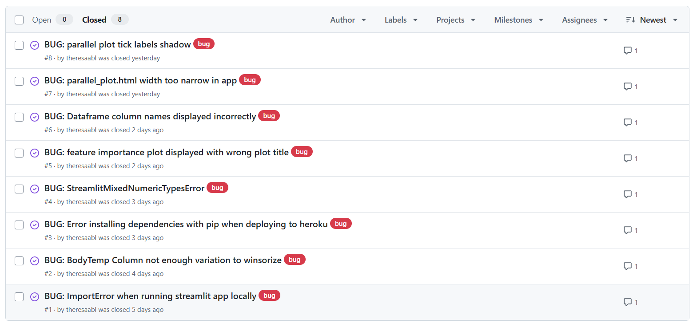

### Unfixed Bugs

> [!IMPORTANT]
> There are no remaining bugs that I am aware of, though, even after thorough testing, I cannot rule out the possibility.